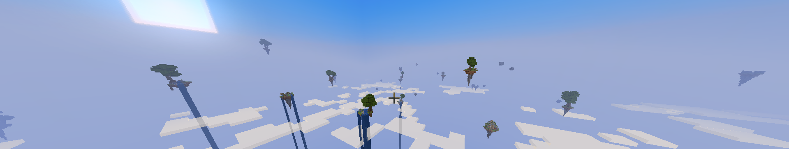

  

<h1> 2 Tips for Guiding Players In Open Worlds </h1>

 (Visualized in Minecraft) 

 Here are two simple tips around map/level designing that can enhance a player's experience playing games that encourage exploration. 

<h2> Usage of Light </h2>

  
  
 <i>*Above are two images of a backrooms inspired level. How does lighting affect your navigational intuition?*</i> 

The light is a tool that can be harnessed. The simplest way to bring attention to a objective is by contrasting a dark enviornment with a small light.

 Much like moths, people are drawn to the light which should make lighting choice a calculated decision to give players the ability to not only see, but navigate their surroundings effectively. 

For instance, in the above image of a backrooms inspired level, the left hand side gives no visible objective to get to. 
Meanwhile, the right hand side shows a clear goal to get to via the contrast of light and dark.

<h2> Cardinal Colors </h2>

 In Video Games, 

<a href="https://www.gamedeveloper.com/design/color-in-games-an-in-depth-look-at-one-of-game-design-s-most-useful-tools">Check This Article Out For More In Depth Color Theory</a>

