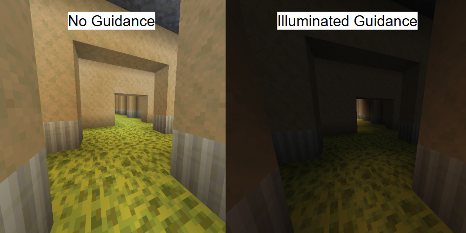

  <h1>Guiding Players in Video Games</h1>
  
(Visualized in Minecraft)

<h1> 2 Tips for Guiding Players In Open Worlds </h1>

 Here are two simple tips around map/level designing that can enhance a player's experience playing games that encourage exploration. 

<h2> Usage of Light </h2>

  
  
 <i>Above are two images of a backrooms inspired level. How does lighting affect your navigational intuition?</i> 

The light is a tool that can be harnessed. The simplest way to bring attention to a objective is by contrasting a dark enviornment with a small light. Much like moths, people are drawn to the light which should make lighting choice a calculated decision to give players the ability to not only see, but navigate their surroundings effectively. 

<h2> Cardinal Colors </h2>

 

 <i>Above shows two examples of easily recognizable parkour opportunities inside and across buildings. </i> 

 In video games, color is one of the strongest tools for guiding players and in order to wield it properly, you must learn the language people have built over time. In particular, yellow is one of the most important cardinal color, often marking points of interest, breakable crates, or climbable ledges. By keeping these “cardinal” colors consistent, you can subtly direct players without text, arrows, or dialogue. 

<a href="https://www.gamedeveloper.com/design/color-in-games-an-in-depth-look-at-one-of-game-design-s-most-useful-tools">Check This Article Out For More In Depth Color Theory</a>

